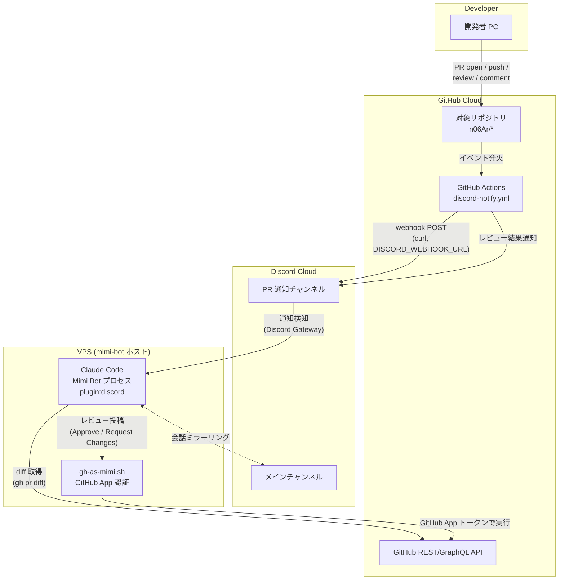

# 🐱 mimi-bot

Discord 上で GitHub PR を自動レビューする Claude Code bot。

## 概要

Pull Request が開かれると GitHub Actions が Discord に通知を送り、Claude Code（mimi-bot）が自動でコードレビューを実行します。

## アーキテクチャ

```
Developer → GitHub PR → GitHub Actions → Discord Webhook
                                              ↓
                                         Mimi Bot (Claude Code)
                                              ↓
                                         GitHub API (Review)
```

## ネットワーク構成図



- **GitHub Actions → Discord**: `discord-notify.yml` が `DISCORD_WEBHOOK_URL`（Incoming Webhook）に直接 `curl` で POST する。中間サーバーは経由しない。
- **Discord → Mimi Bot**: Claude Code が Discord プラグイン経由でチャンネルを購読し、通知メッセージを検知する（`.claude/rules/github.md` の auto-review フロー）。
- **Mimi Bot → GitHub**: 読み取りは通常の `gh` コマンド、書き込み（レビュー投稿・コメント）は GitHub App 認証を挟む `~/.claude/shells/gh-as-mimi.sh` を必ず経由する。
- 詳細な PR レビューのシーケンスは [`local/review-flow.mmd`](local/review-flow.mmd) を参照。

## セットアップ

### 1. GitHub App の作成

[GitHub Developer Settings](https://github.com/settings/apps/new) で App を作成。

必要な権限：
- Contents: Read
- Metadata: Read
- Pull requests: Read & Write

Webhook イベント：
- Pull request

### 2. Discord Bot の作成

[Discord Developer Portal](https://discord.com/developers/applications) で Bot を作成し、サーバーに追加。

必要な権限：
- Read Messages / View Channels
- Send Messages
- Read Message History

### 3. 環境変数の設定

`~/.config/mimi-bot/env` を作成：

```bash
DISCORD_BOT_TOKEN="your-bot-token"
MIMI_MAIN_CHANNEL_ID="your-main-channel-id"
MIMI_PR_CHANNEL_ID="your-pr-channel-id"
```

### 4. GitHub App の鍵を配置

```bash
~/.config/mimi-bot/private-key.pem  # GitHub App の秘密鍵
~/.config/mimi-bot/app-id           # GitHub App ID
```

### 5. Discord プラグインのインストール

Claude Code を起動して：

```
/plugin install discord@claude-plugins-official
/reload-plugins
```

### 6. PR 通知ワークフローの追加

対象リポジトリに `.github/workflows/discord-notify.yml` を追加し、`DISCORD_WEBHOOK_URL` シークレットを設定。

サンプルワークフロー → 対象リポジトリの `.github/workflows/discord-notify.yml` 参照

### 7. 起動

```bash
DISCORD_STATE_DIR="$HOME/.claude/channels/mimi-discord" \
claude --channels plugin:discord@claude-plugins-official
```

または：

```bash
make discord-bot/start
```

## ファイル構成

```
mimi-bot/
├── CLAUDE.md                        # キャラ設定・ルール
├── Makefile                         # 起動スクリプト
├── .claude/
│   ├── output-styles/
│   │   └── mimi.md                  # ミミのキャラクター定義
│   ├── rules/
│   │   ├── discord.md               # Discord 応答ルール
│   │   └── github.md                # GitHub 操作ルール（PR 自動レビュー）
│   └── agents/
│       ├── code-reviewer.md         # コードレビューエージェント
│       └── coder-diff-reviewer.md   # 差分レビューエージェント
└── .gitignore
```

## カスタマイズ

キャラクターや機能を追加したい場合はこの mimi-bot を fork してください。
